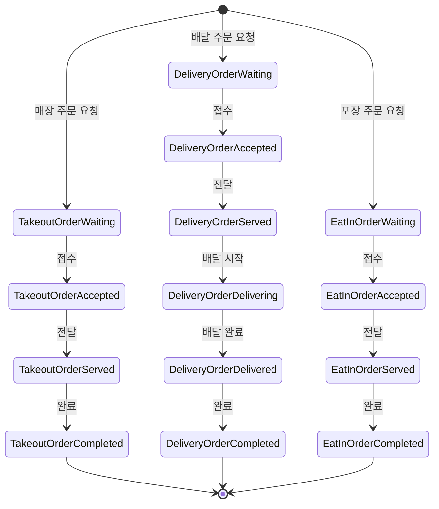

# 키친포스

## 퀵 스타트

```sh
cd docker
docker compose -p kitchenpos up -d
```

## 요구 사항

### 상품

- 상품을 등록할 수 있다.
- 상품의 가격이 올바르지 않으면 등록할 수 없다.
    - 상품의 가격은 0원 이상이어야 한다.
- 상품의 이름이 올바르지 않으면 등록할 수 없다.
    - 상품의 이름에는 비속어가 포함될 수 없다.
- 상품의 가격을 변경할 수 있다.
- 상품의 가격이 올바르지 않으면 변경할 수 없다.
    - 상품의 가격은 0원 이상이어야 한다.
- 상품의 가격이 변경될 때 메뉴의 가격이 메뉴에 속한 상품 금액의 합보다 크면 메뉴가 숨겨진다.
- 상품의 목록을 조회할 수 있다.

### 메뉴 그룹

- 메뉴 그룹을 등록할 수 있다.
- 메뉴 그룹의 이름이 올바르지 않으면 등록할 수 없다.
    - 메뉴 그룹의 이름은 비워 둘 수 없다.
- 메뉴 그룹의 목록을 조회할 수 있다.

### 메뉴

- 1 개 이상의 등록된 상품으로 메뉴를 등록할 수 있다.
- 상품이 없으면 등록할 수 없다.
- 메뉴에 속한 상품의 수량은 0 이상이어야 한다.
- 메뉴의 가격이 올바르지 않으면 등록할 수 없다.
    - 메뉴의 가격은 0원 이상이어야 한다.
- 메뉴에 속한 상품 금액의 합은 메뉴의 가격보다 크거나 같아야 한다.
- 메뉴는 특정 메뉴 그룹에 속해야 한다.
- 메뉴의 이름이 올바르지 않으면 등록할 수 없다.
    - 메뉴의 이름에는 비속어가 포함될 수 없다.
- 메뉴의 가격을 변경할 수 있다.
- 메뉴의 가격이 올바르지 않으면 변경할 수 없다.
    - 메뉴의 가격은 0원 이상이어야 한다.
- 메뉴에 속한 상품 금액의 합은 메뉴의 가격보다 크거나 같아야 한다.
- 메뉴를 노출할 수 있다.
- 메뉴의 가격이 메뉴에 속한 상품 금액의 합보다 높을 경우 메뉴를 노출할 수 없다.
- 메뉴를 숨길 수 있다.
- 메뉴의 목록을 조회할 수 있다.

### 주문 테이블

- 주문 테이블을 등록할 수 있다.
- 주문 테이블의 이름이 올바르지 않으면 등록할 수 없다.
    - 주문 테이블의 이름은 비워 둘 수 없다.
- 빈 테이블을 해지할 수 있다.
- 빈 테이블로 설정할 수 있다.
- 완료되지 않은 주문이 있는 주문 테이블은 빈 테이블로 설정할 수 없다.
- 방문한 손님 수를 변경할 수 있다.
- 방문한 손님 수가 올바르지 않으면 변경할 수 없다.
    - 방문한 손님 수는 0 이상이어야 한다.
- 빈 테이블은 방문한 손님 수를 변경할 수 없다.
- 주문 테이블의 목록을 조회할 수 있다.

### 주문

- 1개 이상의 등록된 메뉴로 배달 주문을 등록할 수 있다.
- 1개 이상의 등록된 메뉴로 포장 주문을 등록할 수 있다.
- 1개 이상의 등록된 메뉴로 매장 주문을 등록할 수 있다.
- 주문 유형이 올바르지 않으면 등록할 수 없다.
- 메뉴가 없으면 등록할 수 없다.
- 매장 주문은 주문 항목의 수량이 0 미만일 수 있다.
- 매장 주문을 제외한 주문의 경우 주문 항목의 수량은 0 이상이어야 한다.
- 배달 주소가 올바르지 않으면 배달 주문을 등록할 수 없다.
    - 배달 주소는 비워 둘 수 없다.
- 빈 테이블에는 매장 주문을 등록할 수 없다.
- 숨겨진 메뉴는 주문할 수 없다.
- 주문한 메뉴의 가격은 실제 메뉴 가격과 일치해야 한다.
- 주문을 접수한다.
- 접수 대기 중인 주문만 접수할 수 있다.
- 배달 주문을 접수되면 배달 대행사를 호출한다.
- 주문을 서빙한다.
- 접수된 주문만 서빙할 수 있다.
- 주문을 배달한다.
- 배달 주문만 배달할 수 있다.
- 서빙된 주문만 배달할 수 있다.
- 주문을 배달 완료한다.
- 배달 중인 주문만 배달 완료할 수 있다.
- 주문을 완료한다.
- 배달 주문의 경우 배달 완료된 주문만 완료할 수 있다.
- 포장 및 매장 주문의 경우 서빙된 주문만 완료할 수 있다.
- 주문 테이블의 모든 매장 주문이 완료되면 빈 테이블로 설정한다.
- 완료되지 않은 매장 주문이 있는 주문 테이블은 빈 테이블로 설정하지 않는다.
- 주문 목록을 조회할 수 있다.

## 용어 사전

### 공통

| 한글명 | 영문명        | 설명                   |
|-----|------------|----------------------|
| 비속어 | Black Word | 손님에게 불쾌감을 주는 단어들의 모음 |

### 상품

| 한글명   | 영문명           | 설명                    |
|-------|---------------|-----------------------|
| 상품    | Product       | 판매될 수 있는 물리적 제품       |
| 상품 가격 | Product Price | 상품을 구매하기 위해 지불해야하는 금액 |
| 상품 이름 | Product Name  | 제품을 식별하기 위한 명칭        |

### 메뉴 그룹

| 한글명      | 영문명             | 설명                                       |
|----------|-----------------|------------------------------------------|
| 메뉴 그룹    | Menu Group      | 여러 메뉴들을 분류하기 위해 묶은 모음                    |
| 메뉴 그룹 이름 | Menu Group Name | 메뉴 모음을 대표하는 이름, e.g. 추천메뉴 / 이벤트메뉴 / 셋트메뉴 |

### 메뉴

| 한글명      | 영문명                | 설명                  |
|----------|--------------------|---------------------|
| 메뉴       | Menu               | 손님이 구매 할 수 있는 최소 단위 |
| 메뉴 가격    | Menu Price         | 손님이 지불해야될 금액        |
| 메뉴 이름    | Menu Name          | 상품들을 대표하는 명칭        |
| 메뉴 상품    | Menu Product       | 손님에게 제공하는 제품        |
| 메뉴 상품 개수 | Menu Product Count | 손님에게 제공되는 제품 수량     |
| 숨김 메뉴    | Hide Menu          | 손님에게 메뉴가 숨겨진 상태     |
| 노출 메뉴    | Displayed Menu     | 손님에게 메뉴가 노출된 상태     |

### 주문 테이블

| 한글명            | 영문명                      | 설명                            |
|----------------|--------------------------|-------------------------------|
| 주문 테이블         | Order Table              | 매장 주문 손님이 사용하는 테이블            |
| 주문 테이블 이름      | Order Table Name         | e.g. 1번 테이블 / 2번 테이블 / 3번 테이블 |
| 주문 테이블 손님수     | Order Table Guest Number | 테이블을 사용하는 손님수                 |
| 사용하지 않는 주문 테이블 | Cleared Order Table      | 손님이 사용중이지 않은 테이블              |
| 사용중인 주문 테이블    | Occupied Order Table     | 손님이 사용중인 테이블                  |

### 주문

#### 포장 주문

| 한글명      | 영문명                     | 설명                  |
|----------|-------------------------|---------------------|
| 포장 주문    | Takeout Order           | 손님이 주문한 메뉴를 포장하여 제공 |
| 주문 대기    | Takeout Order Waiting   | 포장 주문을 요청된 상태       |
| 주문 접수    | Takeout Order Accepted  | 포장 주문이 접수된 상태       |
| 주문 제공    | Takeout Order Served    | 포장 주문한 메뉴를 제공한 상태   |
| 주문 완료    | Takeout Order Completed | 포장 주문이 완료된 상태       |
| 주문 항목    | Order Line Item         | 손님이 요청한 메뉴 모음       |
| 주문 항목 수량 | Order Line Item Count   | 손님이 주문한 메뉴의 개수      |

#### 배달 주문

| 한글명      | 영문명                       | 설명                               |
|----------|---------------------------|----------------------------------|
| 배달 주문    | Delivery Order            | 손님이 구매한 메뉴를 매장밖 지정된 목적지로 포장하여 제공 |
| 주문 대기    | Delivery Order Waiting    | 배달 주문을 요청된 상태                    |
| 주문 접수    | Delivery Order Accepted   | 배달 주문이 접수된 상태                    |
| 주문 제공    | Delivery Order Served     | 배달 주문한 메뉴를 전달할 준비한 상태            |
| 배달 중     | Delivery Order Delivering | 배달 주문한 메뉴를 전달중인 상태               |
| 배달 완료    | Delivery Order Delivered  | 배달 주문한 메뉴를 전달이 완료된 상태            |
| 주문 완료    | Delivery Order Completed  | 배달 주문이 완료된 상태                    |
| 배달 담당자   | Delivery Rider            | 손님에게 메뉴를 전달하는 역할을 맡은 사람          |
| 배달 주소    | Delivery Address          | e.g 서울특별시 강남구 테헤란로               |
| 주문 항목    | Order Line Item           | 손님이 요청한 메뉴 모음                    |
| 주문 항목 수량 | Order Line Item Count     | 손님이 주문한 메뉴의 개수                   |

#### 매장 주문

| 한글명      | 영문명                    | 설명                 |
|----------|------------------------|--------------------|
| 매장 주문    | Eat-In Order           | 매장 주문 손님이 사용하는 테이블 |
| 주문 대기    | Eat-In Order Waiting   | 매장 주문이 요청된 상태      |
| 주문 접수    | Eat-In Order Accepted  | 매장 주문이 접수된 상태      |
| 주문 제공    | Eat-In Order Served    | 매장 주문한 메뉴를 제공한 상태  |
| 주문 완료    | Eat-In Order Completed | 매장 주문이 완료된 상태      |
| 주문 항목    | Order Line Item        | 손님이 요청한 메뉴 모음      |
| 주문 항목 수량 | Order Line Item Count  | 손님이 주문한 메뉴의 개수     |

## 모델링

### 상품 (Product)

#### 속성

- ``Product``는 상품을 구매하기 위해 지불해야하는 ``Product Price`` 를 가진다.
- ``Product``는 다른 ``Product`` 과 식별할 수 있도록 ``Product Name`` 를 가진다.

#### 행위

- ``Product Price`` 를 변경한다.

#### 정책

- ``Product Name`` 은 ``Black Word`` 가 포함되어서는 안된다.
- ``Product Price`` 는 0원 이상이어야 한다.
- ``Product Price`` 가 변경될 때 ``Menu`` 의 ``Menu Price`` 보다 크면 ``Menu`` 는 ``Hide Menu`` 가 된다.

### 메뉴 그룹 (Menu Group)

#### 속성

- ``Menu Group`` 은 다른 `Menu` 모음을 대표하는  ``Menu Group Name`` 을 가진다.

#### 정책

- ``Menu Group Name`` 은 비워 둘 수 없다.

### 메뉴 (Menu)

#### 속성

- ``Menu`` 는 상품들을 대표하는 ``Menu Name`` 을 가진다.
- ``Menu`` 는 손님이 지불해야되는 ``Menu Price`` 를 가진다.
- ``Menu`` 는 손님에게 제공하는 ``Menu Product`` 를 가진다.
- ``Menu`` 는 분류를 위해 ``Menu Group`` 을 가진다.
- ``Menu`` 는 `Hide Menu` 인지 ``Displayed Menu`` 인지를 나타내는 상태를 가진다.

#### 횅위

- ``Menu Price`` 를 변경한다.
- ``Menu``를 `Hide Menu` 상태로 변경한다.
- ``Menu``를 `Displayed Menu` 상태로 변경한다.

#### 정책

- ``Menu Price`` 는 0원 이상이어야 한다.
- ``Menu Name`` 은 ``Black Word`` 가 포함되어서는 안된다.
- ``Menu Product`` 가 존재하지 않으면 ``Menu`` 를 생성할 수 없다.
- ``Menu Product`` 는 1개 이상이어야 하고 ``Menu Product Count`` 의 총 합이 0 이상이어야 한다.
- ``Menu Product Price`` 의 합은 ``Menu Price`` 보다 크거나 같아야 한다.

### 주문 테이블 (Order Table)

#### 속성

- ``Order Table`` 은 다른 ``Order Table`` 과 구별할 수 있도록 ``Order Table Name`` 을 가진다.
- ``Order Table`` 은 테이블을 사용하는 손님수를 표현하기 위해  ``Order Table Guest Number`` 를 가진다.
- ``Order Table`` 은 ``Cleared Eat-In Table`` 인지 ``Occupied Eat-In Table`` 인지를 나타내는 상태를 가진다.

#### 행위

- ``Order Table`` 을 방문한 손님 수를 변경한다.
- ``Order Table`` 을 빈 테이블로 설정한다.
- ``Order Table`` 을 사용하지 않는 테이블로 설정한다.

#### 정책

- ``Order Table Name`` 은 비워 둘 수 없다.
- ``Order Table Guest Number`` 는 0 이상이어야 한다.
- 완료되지 않은 ``Eat-In Order`` 가 있는 ``Order Table`` 은 ``Cleared Eat-In Table`` 상태로 설정할 수 없다.

### 주문 (Order)



#### 1. 포장 주문 (Takeout Order)

##### 속성

- ``Takeout Order`` 는 손님이 요청한 메뉴 모음인 ``Order Line Item`` 을 가진다.
- ``Takeout Order`` 는 상태를 관리하기
  위해 ``Takeout Order Waiting``, ``Takeout Order Accepted``, ``Takeout Order Served``, ``Takeout Order Completed`` 를 가진다.

##### 행위

- ``Takeout Order`` 를 ``Takeout Order Waiting`` 상태로 변경한다.
- ``Takeout Order`` 를 ``Takeout Order Accepted`` 상태로 변경한다.
- ``Takeout Order`` 를 ``Takeout Order Served`` 상태로 변경한다.
- ``Takeout Order`` 를 ``Takeout Order Completed`` 상태로 변경한다.

##### 정책

- ``Takeout Order`` 는 ``Order Line Item Count`` 가 0 이상이어야 한다.
- ``Takeout Order`` 는 ``Takeout Order Waiting`` 상태에서만 ``Takeout Order Accepted`` 상태로 변경할 수 있다.
- ``Takeout Order`` 는 ``Takeout Order Accepted`` 상태에서만 ``Takeout Order Served`` 상태로 변경할 수 있다.
- ``Takeout Order`` 는 ``Takeout Order Served`` 상태에서만 ``Takeout Order Completed`` 상태로 변경할 수 있다.

#### 2. 배달 주문

##### 속성

- ``Delivery Order`` 는 손님이 요청한 메뉴 모음인 ``Order Line Item`` 을 가진다.
- ``Delivery Order`` 는 배달 도착지인 ``Delivery Address`` 를 가진다.
- ``Delivery Order`` 는 상태를 관리하기
  위해 ``Delivery Order Waiting``, ``Delivery Order Accepted``, ``Delivery Order Served``, ``Delivery Order Delivering``, ``Delivery Order Delivered``, ``Delivery Order Completed``
  를 가진다.

##### 행위

- ``Delivery Order`` 를 ``Delivery Order Waiting`` 상태로 변경한다.
- ``Delivery Order`` 를 ``Delivery Order Accepted`` 상태로 변경한다.
- ``Delivery Order`` 를 ``Delivery Order Served`` 상태로 변경한다.
- ``Delivery Order`` 를 ``Delivery Order Delivering`` 상태로 변경한다.
- ``Delivery Order`` 를 ``Delivery Order Delivered`` 상태로 변경한다.
- ``Delivery Order`` 를 ``Delivery Order Completed`` 상태로 변경한다.

##### 정책

- ``Delivery Order`` 는 ``Order Line Item Count`` 가 0 이상이어야 한다.
- ``Delivery Order`` 는 ``Delivery Address`` 가 비워져 있어서는 안된다.
- ``Delivery Order`` 는 ``Delivery Order Waiting`` 상태에서만 ``Delivery Order Accepted`` 상태로 변경할 수 있다.
- ``Delivery Order`` 는 ``Delivery Order Accepted`` 상태에서만 ``Delivery Order Served`` 상태로 변경할 수 있다.
- ``Delivery Order`` 는 ``Delivery Order Served`` 상태에서만 ``Delivery Order Delivering`` 상태로 변경할 수 있다.
- ``Delivery Order`` 는 ``Delivery Order Delivering`` 상태에서만 ``Delivery Order Delivered`` 상태로 변경할 수 있다.
- ``Delivery Order`` 는 ``Delivery Order Delivered`` 상태에서만 ``Delivery Order Completed`` 상태로 변경할 수 있다.
- ``Delivery Order`` 상태가 ``Delivery Order Accepted`` 로 변경될 때 ``Delivery Rider`` 를 호출한다.

#### 3. 매장 주문

##### 속성

- ``Eat-In Order`` 는 손님이 요청한 메뉴 모음인 ``Order Line Item`` 을 가진다.
- ``Eat-In Order`` 는 상태를 관리하기
  위해 ``Eat-In Order Waiting``, ``Eat-In Order Accepted``, ``Eat-In Order Served``, ``Eat-In Order Completed`` 를 가진다.

##### 행위

- ``Order Table`` 에 ``Eat-In Order`` 를 등록한다.
- ``Eat-In Order`` 를 ``Eat-In Order Waiting`` 상태로 변경한다.
- ``Eat-In Order`` 를 ``Eat-In Order Accepted`` 상태로 변경한다.
- ``Eat-In Order`` 를 ``Eat-In Order Served`` 상태로 변경한다.
- ``Eat-In Order`` 를 ``Eat-In Order Completed`` 상태로 변경한다.

##### 정책

- ``Eat-In Order`` 는 ``Order Line Item Count`` 가 0 이상이어야 한다.
- ``Eat-In Order`` 는 ``Eat-In Order Waiting`` 상태에서만 ``Eat-In Order Accepted`` 상태로 변경할 수 있다.
- ``Eat-In Order`` 는 ``Eat-In Order Accepted`` 상태에서만 ``Eat-In Order Served`` 상태로 변경할 수 있다.
- ``Eat-In Order`` 는 ``Eat-In Order Served`` 상태에서만 ``Eat-In Order Completed`` 상태로 변경할 수 있다.
- ``Eat-In Order`` 상태가 ``Eat-In Order Completed`` 로 변경될 때 ``Order Table`` 을 빈 테이블로 설정한다.
- ``Order Table`` 의 상태가 ``Occupied Eat-In Table`` 인 경우 ``Eat-In Order`` 를 등록할 수 없다.
